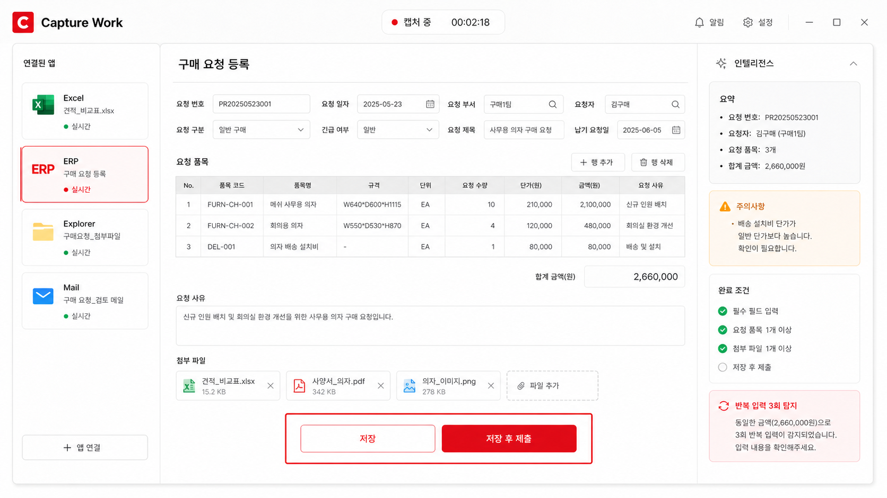
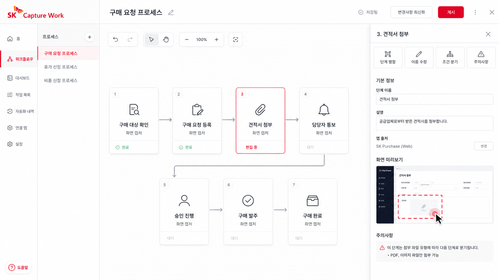
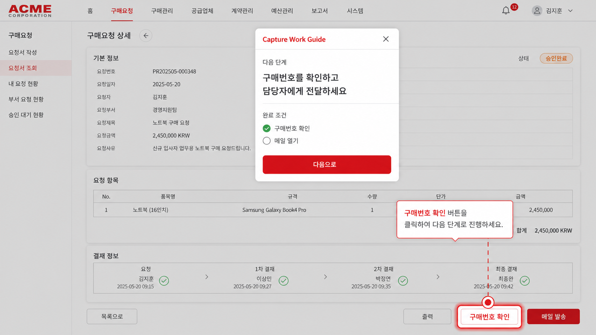

# Capture Work

> 업무를 수행하는 순간, 그 과정을 실행 가능한 표준업무로 변환하는 프로세스 캡처 도구

**Capture clicks가 아니라, Capture work.**

사용자가 업무를 한 번 수행하면 Capture Work가 앱 전환, 클릭, 입력, 첨부, 저장과 제출을 기록합니다. AI는 이 기록을 단순한 이벤트 로그가 아닌 **목표, 단계, 판단, 주의사항, 완료 조건**이 있는 업무 가이드로 구조화합니다. 같은 업무를 다시 수행할 때는 실제 화면 위에서 다음에 눌러야 할 위치를 안내합니다.

[Live Product](https://celeste0423.github.io/tutorial_making_program_demo/) · [GitHub Repository](https://github.com/celeste0423/tutorial_making_program_demo)

## Why Capture Work

업무 매뉴얼의 문제는 문서 형식이 아닙니다. 실제 업무가 여러 프로그램에 흩어져 있고, 화면과 절차가 계속 달라진다는 점입니다.

- Excel에서 대상 데이터를 확인합니다.
- ERP에서 동일한 값을 다시 입력합니다.
- 파일 탐색기에서 증빙을 찾습니다.
- 메일에서 생성된 결과를 다시 전달합니다.
- 담당자는 이 경로와 예외 사항을 별도 문서나 영상으로 다시 설명합니다.

Capture Work는 **업무 수행과 매뉴얼 제작을 하나의 행동으로 합칩니다.** 사용자는 평소처럼 업무를 처리하고, 시스템은 그 순간의 맥락을 실행 가능한 가이드로 바꿉니다.

~~~text
실제 업무 수행
   ↓
앱 · 창 · UI 요소 · 입력 · 첨부 · 제출 캡처
   ↓
AI가 목표 · 단계 · 조건 · 예외 · 완료 기준으로 구조화
   ↓
카드 편집 및 표준업무 확정
   ↓
실제 화면 위에서 라이브 가이드 재생
~~~

## 직접 체험하기

공개 페이지의 **튜토리얼 만들기** 영역은 제품의 핵심 흐름을 처음부터 끝까지 조작할 수 있게 구성되어 있습니다.

1. 업무 이름에 구매 요청 등록을 입력하고 **업무 기록 시작**을 누릅니다.
2. Excel 화면의 **승인 품목 선택**을 누릅니다.
3. ERP 화면의 **저장 후 제출**을 누릅니다.
4. Explorer 화면의 **견적서_최종.pdf**를 누릅니다.
5. Mail 화면의 **메일 보내기**를 누릅니다.
6. **기록 종료 · AI 가이드 생성**을 눌러 업무 카드를 만듭니다.
7. 카드 이름 수정, 순서 이동, 삭제 또는 여러 단계 합치기를 실행합니다.
8. **따라 하기 모드 재생**을 눌러 실제 화면 위의 클릭 안내를 확인합니다.

각 클릭은 활성 앱, 창 제목, UI 요소 이름과 함께 캡처됩니다. 오른쪽 패널에서 AI가 해석한 현재 업무 맥락과 캡처 이벤트를 실시간으로 확인할 수 있습니다.

## 사용자는 영상이 아니라 업무 카드를 편집합니다

긴 타임라인은 영상 편집 경험을 요구합니다. Capture Work는 단계별 카드를 기본 편집 단위로 사용합니다.

~~~text
[1. 구매 대상 확인]  Excel
승인 상태인 품목과 수량을 확인합니다.
완료 조건: 승인 여부와 품목번호 확인

[2. 구매 요청 등록]  ERP
품목번호와 수량을 입력하고 제출합니다.
주의: VAT 포함 여부와 결재 경로 확인

[3. 견적서 첨부]  Explorer
최근 30일 이내 견적서를 첨부합니다.
완료 조건: 파일 형식과 발행일 확인

[4. 담당자 통보]  Mail
생성된 구매번호를 담당자에게 전달합니다.
완료 조건: 구매번호와 수신자 확인
~~~

사용자는 카드 순서를 바꾸고, 이름을 수정하고, 필요 없는 단계를 삭제하고, 여러 단계를 하나로 합칠 수 있습니다. 업무 전문가가 별도 영상 편집 기술 없이 표준업무를 완성하는 경험을 목표로 합니다.

## 실제 화면 위에서 다시 실행합니다

완성된 가이드는 별도의 영상 플레이어가 아니라 사용자가 현재 보고 있는 업무 화면 위에서 재생됩니다.

- 현재 단계와 업무 목적
- 다음에 눌러야 할 실제 버튼
- 단계별 주의사항
- 완료 조건
- 전체 진행률

## Hackathon MVP

영역 | 구현 내용
--- | ---
제품 소개 | 문제, 해결 방식, 확장 가능성을 설명하는 반응형 랜딩 페이지
튜토리얼 입력 | 업무 이름 입력, 기록 시작, 앱 전환, 클릭 이벤트 캡처
자동 감지 | 활성 앱, 창 제목, UI 요소, 저장·제출·파일 선택 이벤트 표현
AI 구조화 | 클릭 맥락 설명, 단계명, 설명, 주의사항, 완료 조건 생성
카드 편집 | 선택, 순서 이동, 이름 수정, 삭제, 여러 단계 합치기
따라 하기 | 앱별 실제 화면과 빨간 클릭 영역, 단계 설명, 이전·다음 재생
제품 영상 | 캡처 → 구조화 → 재생을 연결한 WebM 제품 릴
배포 | GitHub Actions 기반 GitHub Pages 자동 배포

현재 버전은 해커톤 심사를 위한 웹 MVP입니다. 운영 단계에서는 데스크톱 에이전트가 OS 접근성 API와 브라우저 DOM을 사용해 실제 프로그램의 요소 위치와 창 상태를 수집하고, 웹 편집기와 가이드 플레이어가 공통 업무 스키마를 사용하게 됩니다.

## Product Architecture

~~~text
Desktop / Browser Capture
  ├─ Active application & window title
  ├─ Clicked UI element & coordinates
  ├─ Copy, paste, file attach, save, submit
  └─ Important / caution / decision hotkeys
                 ↓
AI Process Structuring
  ├─ Goal and step grouping
  ├─ Context-aware descriptions
  ├─ Conditions, exceptions and warnings
  └─ Repetition and unnecessary round-trip detection
                 ↓
Guide Editor & Live Player
  ├─ Card reorder, merge, delete and rename
  ├─ Completion criteria
  └─ Live UI highlight overlay
~~~

## 저장소 구성

경로 | 역할
--- | ---
<code>index.html</code> | 제품 소개와 인터랙티브 튜토리얼 생성 화면
<code>styles.css</code> | SK 레드 기반 디자인 시스템, 업무 화면, 반응형 레이아웃
<code>script.js</code> | 캡처 상태, 앱 전환, AI 카드 생성·편집, 라이브 재생 로직
<code>assets/capture-hero.png</code> | 데스크톱 캡처 제품 화면
<code>assets/workflow-editor.png</code> | 카드형 업무 편집 제품 화면
<code>assets/live-guide.png</code> | 실제 화면 위 라이브 가이드 제품 화면
<code>assets/demo-reel.webm</code> | End-to-End 제품 영상
<code>.github/workflows/deploy.yml</code> | GitHub Pages 자동 배포

## 로컬 실행

별도 빌드 없이 실행되는 정적 웹 프로젝트입니다.

~~~bash
python -m http.server 4173
~~~

브라우저에서 <code>http://127.0.0.1:4173</code>을 열면 됩니다.

## GitHub Pages 배포

<code>main</code> 브랜치에 푸시하면 GitHub Actions가 정적 파일을 GitHub Pages에 배포합니다.

~~~text
main push
   → Deploy to GitHub Pages workflow
   → GitHub Pages artifact upload
   → https://celeste0423.github.io/tutorial_making_program_demo/
~~~

Pages 설정은 **GitHub Actions**를 배포 소스로 사용합니다. 배포 상태는 저장소의 Actions 탭에서 확인할 수 있습니다.

## Demo Scenario

해커톤 발표에서는 다음 70초 흐름을 기준으로 시연합니다.

~~~text
0–10초   기존 매뉴얼의 문제와 Capture Work 정의
10–25초  업무 이름 입력 후 캡처 시작
25–42초  Excel → ERP → Explorer → Mail 클릭 캡처
42–55초  AI 업무 카드, 주의사항, 반복 입력 탐지 확인
55–65초  카드 합치기와 이름 수정
65–70초  실제 화면 위 따라 하기 모드 재생
~~~

핵심은 녹화 기술 자체가 아닙니다. **사람의 한 번의 업무 수행을 영상이 아니라 목표, 단계, 조건, 예외와 완료 기준으로 변환하는 기록 방식**입니다.
